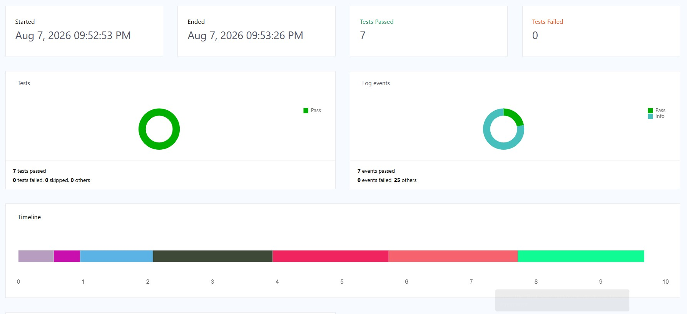

# GPI Calendar Automation

A test automation project for the travel insurance calendar on [mygpi.ge](https://mygpi.ge/ka-GE/mg-purchase/travel/policy). This is my final project for the Quality Academy Java/Selenium course.

## What this project does

The project tests the date-range calendar that users interact with when buying travel insurance. It covers 5 UI test scenarios (opening the calendar, selecting dates, validation, navigation, and page refresh — 6 test methods in total, since one scenario is split into two checks) plus 1 API test case using RestAssured. That's 7 automated tests in total, all passing.



## Tech Stack

- Java 21
- Maven
- Selenium WebDriver 4.45.0
- WebDriverManager 6.3.4
- TestNG 7.12.0
- RestAssured 6.0.1
- ExtentReports 5.1.2

## Design Pattern

I used **Page Object Model (POM) with PageFactory**. Each page of the site (the calendar page, the "insured details" page) has its own class with locators and actions. The test classes only call these actions and check the results — they don't touch locators directly.

I chose POM over BDD/Cucumber because it let me build and test each case faster within my timeline.

## Project Structure

```
GpiCalendarAutomation/
├── pom.xml
├── testNG.xml
├── config.properties
├── report/
│   └── ExtentReport.html
└── src/
    ├── main/java/org/example/
    │   ├── pages/
    │   │   ├── CalendarPage.java
    │   │   └── InsuredDetailsPage.java
    │   ├── utils/
    │   │   ├── ApiClient.java
    │   │   ├── ConfigReader.java
    │   │   ├── DriverManager.java
    │   │   ├── ExtentReportManager.java
    │   │   ├── TestListener.java
    │   │   └── Utils.java
    │   └── BasePage.java
    │
    └── test/java/org/example/
        ├── Tests/
        │   ├── ApiTest.java
        │   └── CalendarTest.java
        └── BaseTest.java
```

## Test Cases

| # | Test Case | Type | What it checks |
|---|---|---|---|
| 1 | Calendar opens on click | Positive | The calendar opens when I click the date field, and it shows the correct current month and today's date |
| 2 | Select a date range | Positive | I can select a start and end date, the input fills in correctly, and clicking "Continue" moves me to the next step |
| 3 | Empty period shows an error | Negative | If I click "Continue" without picking any dates, I see the validation error message |
| 4 | Dates stay after Back navigation | Positive | If I go to the next step and then click "Back", my selected dates are still there |
| 5 | Page refresh clears the dates | Edge case | If I refresh the page after selecting dates, the calendar resets to empty |
| API | GET request check | Positive | A GET request to reqres.in returns status code 200 |

## Why I picked these cases

I wanted the 5 UI cases to cover the whole basic flow of the calendar — opening it, using it correctly, using it incorrectly, and checking what happens when you navigate away and back. I picked "Back navigation" and "Page refresh" together on purpose, because they test two different ways of leaving the page, and they actually behave differently (Back keeps your dates, Refresh clears them). I decided not to test rapid clicking, because Selenium can't reliably copy how fast a real person clicks, so that test would not have given trustworthy results.

I used dynamic dates (`LocalDate.now()`) everywhere instead of fixed dates, so the tests keep working no matter what day they are run.

## How to Run

```bash
mvn clean test
```

This uses `testNG.xml` to decide which tests to run. After the run finishes, open the report here:

```
report/ExtentReport.html
```

## Configuration

`config.properties` is in the project's root folder:

```properties
wait=10
base.url=https://mygpi.ge/ka-GE/mg-purchase/travel/policy
```

## A few things I learned while building this

- The date input field is `readonly`, so dates have to be selected by clicking on the calendar, not typed in.
- Selecting a date takes the page 6-7 seconds to load, so I used Explicit Wait everywhere instead of a fixed sleep time.
- The site's calendar had changed since I wrote my manual test cases for it earlier in the course, so I double-checked everything myself in the browser instead of trusting my old notes.
- I caught a test that only failed sometimes (not every run) by running it several times in a row until it failed, traced it to a missing wait in one method, and fixed it. It's been stable ever since.

## Author

Ana Danelia — Junior QA Manual Tester, moving into Automation QA (Java/Selenium).